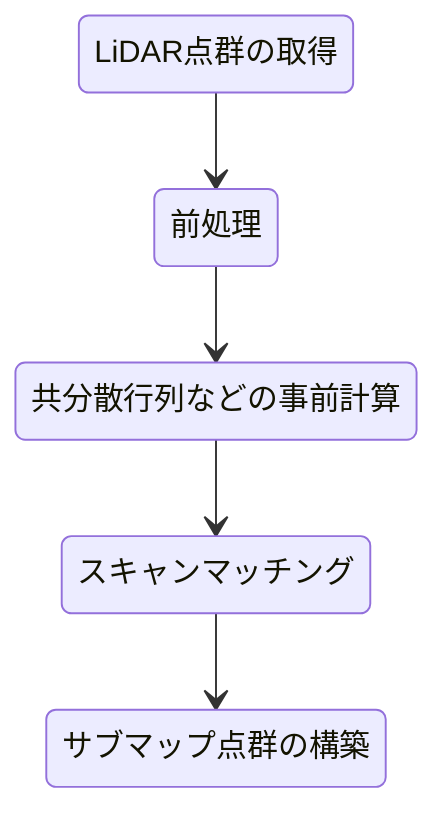

# 設計思想

## はじめに

`sycl_points`はLiDARオドメトリ推定を行うためのスキャンマッチングの実装に力を入れています。

オドメトリ推定とは、車載や手持ちのLiDARから取得される点群データから相対移動量を推定することです。

スキャンマッチングは2つの点群からそれらの相対位置関係を計算するアルゴリズムです。

LiDARオドメトリ推定は以下のような処理フローを想定しています。

特にLiDAR点群のみからロバストにオドメトリ推定が行えるような設計を行っています。

## 前処理
スキャンマッチングに不要な点群を削除することでマッチング精度を向上させたり、点群数を減らすことで前処理以降の処理時間を減らすことが目的です。

## 共分散行列などの事前計算
スキャンマッチングアルゴリズムには事前に計算しておく必要のあるデータがあります。

- Point-to-Point: 事前計算の必要なし
- Point-to-Plane: ターゲット点群（サブマップ点群）の法線ベクトル
- GICP: ソース点群（LiDAR点群）とターゲット点群（サブマップ点群）の共分散行列

共分散行列というのは、ある点の周りのN点の座標の分布を計算しておくということです。

一般にはKDTreeを用いて近傍探索を行い、近傍点の座標から共分散行列を計算します。

GICPでは、一般的にさらにこの共分散行列を修正して、分布がほぼ平面になるように固有値の置き換え処理を行います。

## スキャンマッチング
本題です。基本的にはGICPが一番精度が高く、ロバストな手法です。

`sycl_points`では単にGICPを用いるだけでなく、よりロバストにマッチングが行えるようなアルゴリズムをいくつか導入しています。

### 最適化手法
ガウスニュートン法、レーベンバーグ・マルカート法、ドッグレッグ法を実装しています。

### ロバスト推定
HUBER, TUKEY, CAUCHY, GEMAN_MCCLUREによるロバスト推定を実装しています。

ロバスト推定でのスケール値を徐々に小さくしながら繰り返し最適化を行うことでよりロバストなマッチングを行うことが可能です。

### 点群歪み補正
回転式のLiDARから得られる点群は、1回のスキャンを行う間の物理的なLiDARのの移動や旋回運動によって点群が歪みます。

一般的にはIMUを使い、1回のスキャン内の相対移動量・回転量を求めて歪み補正を行います。

LiDAR点群だけでは厳密な歪み補正はできませんが、1回のスキャン内の移動が等速運動であると仮定することで、歪み補正を行うことが可能です。IMU使用時に比べると補正精度は劣りますが、LiDAR点群のみでも行うことができるのがメリットです。

歪み補正を行うには、点群の各点にタイムスタンプがついていることが条件です。

### 縮退検出
まっすぐな廊下のような環境だと、ほぼ長方形の筒状の点群が得られてマッチングが不安定になりがちです。このような状況を縮退が発生しているといいます。

点群の形状に特徴が少なくなることで複数の解が得られてしまい、実際にはまっすぐ進んでいるのにオドメトリ推定結果は静止したり、後退したりすることがあります。

縮退検出は、解くべき連立方程式の係数行列（ヘッセ行列）に対して固有値分解を行うことで縮退を判定します。固有値分解を行うことで、どの向きに縮退しているのか（どの方向のマッチングが不安定なのか）を解析することも可能です。

縮退が検出された場合は、その縮退方向に制約を加えることで、解が行き過ぎたりするのを防ぎます。

## サブマップ点群の構築

スキャンマッチングのターゲット点群として用いるサブマップ点群を構築します。

ボクセルマップ（VoxelHashMap）と専有格子地図（OccupancyGridMap）を実装しています。

専有格子地図のほうが計算コストはかかりますが、オドメトリ推定のサブマップ点群としてはよりロバストなアルゴリズムです。
