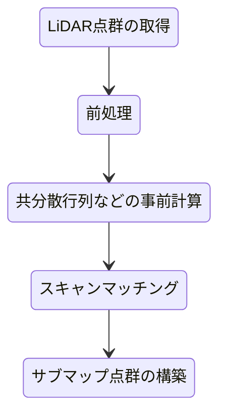

# 設計思想

## はじめに

点群処理とSYCLの勉強を目的とした趣味で作成しているC++ライブラリです。

`sycl_points`はLiDARオドメトリ推定を行うためのスキャンマッチングの実装に力を入れています。

オドメトリ推定とは、車載や手持ちのLiDARから取得される点群データから相対移動量を推定することです。

スキャンマッチングは2つの点群からそれらの相対位置関係を計算するアルゴリズムです。

LiDARオドメトリ推定は以下のような処理フローを想定しています。

特に**LiDAR点群のみ**からロバストにオドメトリ推定が行えるような設計を行っています。

## 前処理
スキャンマッチングに不要な点群を削除することでマッチング精度を向上させたり、点群数を減らすことで前処理以降の処理時間を減らすことが目的です。

特に車両やLiDARを持っている人の映り込みはなるべく削除することでマッチング精度が向上します。

## 共分散行列などの事前計算
スキャンマッチングアルゴリズムには事前に計算しておく必要のあるデータがあります。

- Point-to-Point: 事前計算の必要なし
- Point-to-Plane: ターゲット点群（サブマップ点群）の法線ベクトル
- Point-to-Distribution: ターゲット点群（サブマップ点群）の共分散行列
- GICP: ソース点群（LiDAR点群）とターゲット点群（サブマップ点群）の共分散行列

共分散行列というのは、ある点の周りのN点の座標の分布を計算しておくということです。

一般にはKDTreeを用いて近傍探索を行い、近傍点の座標から共分散行列を計算します。

GICPでは、一般的にはこの共分散行列をさらに固有値分解し、分布がほぼ平面になるように固有値の置き換え処理を行います。
`small_gicp`などの実装では、事前計算時に固有値置き換え処理を行っていますが、`sycl_points`での実装はGICP計算時に行います。これは他の処理で共分散行列を使用するときに、平面近似してしまうことで使いにくくなることが考えられるためです。

GICP計算時に毎ループごとに固有値分解を行うのは計算時間の無駄ではないかと思われるかもしれませんが、大した計算量ではなく、トータルの処理時間には大きな影響はありません。

## スキャンマッチング
本題です。基本的にはGICPが一番精度が高く、ロバストな手法です。

`sycl_points`では単にGICPを用いるだけでなく、よりロバストにマッチングが行えるようなアルゴリズムをいくつか導入しています。

### スキャンマッチングアルゴリズム

まず、スキャンマッチングアルゴリズムの違いについて簡単に解説します。

#### Point-to-Point
対応するソース点とターゲット点のユークリッド距離を最小化します。

ソース点とターゲット点がまったく同じ位置に存在すれば精度よく合わせ込みができます。しかし、LiDAR点群の観測点の間隔は一定ではなく、ノイズもあり、同じ物体の同じ位置の点群が得られることはほぼないので、LiDARオドメトリ推定に使うには精度があまりよくありません。

#### Point-to-Plane
ターゲット点を平面(Plane)と見立てて、ソース点からターゲット平面までのユークリッド距離を最小化します。

ソース点がターゲット平面上でずれる分には誤差ゼロですが、、平面からずれる分だけ誤差値が大きくなります。

Point-to-Pointではまったく同じ位置に点が存在しないと合わせ込みがうまくできませんでしたが、ソース点がターゲット平面上に合わせ込まれるので、Point-to-Pointに比べるとマッチング精度は高くなりやすいです。

#### Point-to-Distribution
ターゲット点の共分散行列を用いて、ソース点とターゲット点のマハラノビス距離を最小化します。

マハラノビス距離を最小化するため、共分散が楕円形であれば長辺方向の座標のズレは許容され、短辺方向のズレは厳しく評価されます。

Point-to-Planeでは平面上のズレは誤差ゼロであったのに対して、Point-to-Distributionでは共分散の長辺方向のズレも誤差ゼロにはなりません。

Point-to-Planeと比べると、位置合わせが滑りにくいという印象です。

GICPもマハラノビス距離を計算しますが、GICPではソース点の共分散行列も使用します。

#### GICP
ソース点とターゲット点の共分散行列を用いて、ソース点とターゲット点のマハラノビス距離を最小化します。

ソース点とターゲット点の共分散行列を足し合わせた合成共分散行列を使ってマハラノビス距離を計算しています。

合成共分散からマハラノビス距離を計算しているということは、ソース点とターゲット点が同じような共分散行列を持っている場合には拘束として働き、共分散楕円の向きが異なるようなミスマッチの場合には拘束が弱くなるということであると私は理解しています。

ソース点とターゲット点の共分散がほぼ平面であり、同じ向きをしていた場合、合成共分散もほぼ平面となります。共分散がほぼ平面であっても、向きが異なった場合には合成共分散は平面ではなくなり、楕円のようなぼやけた形状になります。

合成共分散が平面であればPoint-to-Distributionのような挙動となり、平面方向への強い拘束を発揮します。合成共分散がぼやけてくると特定の方向への拘束はなくなり、Point-to-Pointに近い挙動となります。

明確な切り替えを行うことなく、Point-to-PointからPoint-to-DistributionまでをスムーズにつなぐことのできるロバストなICPマッチングとなっています。

### 最適化手法
ガウスニュートン法（GN）、レーベンバーグ・マルカート法（LM）、ドッグレッグ法（DOGLEG）を実装しています。

### ロバスト推定
`HUBER`, `TUKEY`, `CAUCHY`, `GEMAN_MCCLURE`カーネルによるロバスト推定を実装しています。

ロバスト推定でのスケール値を徐々に小さくしながら繰り返し最適化を行うことでよりロバストなマッチングを行うことが可能です。

### 点群歪み補正
回転式のLiDARから得られる点群は、1回のスキャンを行う間の物理的なLiDARのの移動や旋回運動によって点群が歪みます。

一般的にはIMUを使い、1回のスキャン内の相対移動量・回転量を求めて歪み補正を行います。

LiDAR点群だけでは厳密な歪み補正はできませんが、1回のスキャン内の移動が等速運動であると仮定することで、歪み補正を行うことが可能です。IMU使用時に比べると補正精度は劣りますが、LiDAR点群のみでも行うことができるのがメリットです。

歪み補正を行うには、点群の各点にタイムスタンプがついていることが条件です。

### 縮退検出
まっすぐな廊下のような環境だと、ほぼ長方形の筒状の点群が得られてマッチングが不安定になりがちです。このような状況を縮退が発生しているといいます。

点群の形状に特徴が少なくなることで複数の解が得られてしまい、実際にはまっすぐ進んでいるのにオドメトリ推定結果は静止したり、後退したりすることがあります。

縮退検出は、解くべき連立方程式の係数行列（ヘッセ行列）に対して固有値分解を行うことで縮退を判定します。固有値分解を行うことで、どの向きに縮退しているのか（どの方向のマッチングが不安定なのか）を解析することも可能です。

縮退が検出された場合は、その縮退方向に制約を加えることで、解が行き過ぎたりするのを防ぎます。

### 初期姿勢推定
スキャンマッチングの精度を高めるには、初期値をなるべく正しく与えてあげる必要があります。
現在の実装では、直近2フレームのオドメトリ結果を使って速度を求め、速度から現在位置を予測しています。

また、前回のスキャンマッチング結果を用いて、縮退判定を行い、縮退度合いによって位置予測をスケーリングしています。縮退していない場合は、速度に対して小さな係数をかけて姿勢が進みすぎないようにします。縮退している場合は、`〜1.0`の係数をかけることで等速運動を仮定して位置予測を行います。

前述の`縮退検出`と組み合わせることで、多少の縮退環境であれば大きく破綻することなくオドメトリ推定を行うことが可能です。

### 回転拘束
GICPは前述の通り、合成共分散行列を使い、ソース点とターゲット点間のマハラノビス距離を最小化するように動作します。

このとき共分散行列の形状ズレは合成共分散を使って間接的に評価されていますが、直接的に誤差値には含まれていません。そこで、この共分散行列の形状ズレを誤差値に組み込むことで回転方向に拘束・制約を与えることができるのではないかと考えています。

オリジナルのアルゴリズムなので詳細に解説します。

参考にしたのは、`Jensen-Bregman LogDet Divergence`という評価指標です。対称正定値行列 (SPD行列) 間の距離を計算することができます。

$$ D_{JBLD​}(C_i,C_j)=logdet(\frac{C_i+C_j}{2}​) − \frac{1}{2} * ​logdet(C_i) − \frac{1}{2} * ​logdet(C_j) $$

2つの共分散行列の形状が完全一致していると$D_{JBLD​}$はゼロとなり、形状が異なると正の値を取ります。

JBLDを選んだ理由としては、値がゼロ以上であること、2つの共分散行列を入れ替えても計算結果が変わらない（対称性がある）ため、比較的単純な演算の組み合わせで計算できるためです。

ICPで最適化しているのは、位置と姿勢角ですが、共分散行列に関係するのは姿勢角のみです。そのため最適化するには、姿勢角（回転行列）に対してJBLDを微分する必要があります。

#### 線形化処理

JBLDの計算式をICPマッチングに当てはめます。

$$ D = \log \det \left( \frac{C_s' + C_t}{2} \right) - \frac{1}{2} \log \det(C_s') - \frac{1}{2} \log \det(C_t) $$

- $C_s$: ソース点の共分散行列
- $C_t$: ターゲット点の共分散行列
- $C_s' = R C_s R^T$: ターゲット座標系に変換されたソース共分散行列
- $R$: 最適化したい回転行列

ここで、回転行列$R$の性質（$\det(R)=1$）から、$\det(C_s') = \det(R C_s R^T) = \det(C_s)$ となり、$\log \det(C_s')$は$R$に依存しない定数です。$\det(C_t)$も同様に定数です。
したがって、勾配を計算する上で微分が必要なのは第1項のみです。第1項のみを実質的な目的関数を $L(R)$ とします。

$$ L(R) = \log \det(M), \quad \text{where} \quad M = \frac{C_s' + C_t}{2} $$

回転行列$R$に関する$L(R)$の勾配を導出します。

まず、行列の対数行列式の微分公式は以下の通りです。

$$ \delta(\log \det M) = \text{tr}(M^{-1} \delta M) $$

$M = \frac{1}{2}(C_s' + C_t)$ なので、$\delta M = \frac{1}{2} \delta C_s'$ となります。

次に、回転の微小な摂動 $\omega$ (3次元ベクトル) による $C_s'$ の変化 $\delta C_s'$ は、交換子積を用いて $\delta C_s' = [[\omega]_\times, C_s']$ と表せます。

これらを代入し、トレースの性質を使って式を整理すると、グローバル座標系（ターゲット座標系）での摂動 $\omega_{global}$ に対する目的関数の変化 $\delta L$ は以下のように導出されます。

$$ \delta L = -\text{vex}([C_s', M^{-1}]) \cdot \omega_{global} $$

ここで $\text{vex}$ は歪対称行列からベクトルを抽出する演算子です。
最適化はソース点群のローカル座標系で行うため、グローバル座標系の勾配をローカル座標系に変換する必要があります。グローバルな摂動とローカルな摂動の関係 $\omega_{global} = R \omega_{local}$ を用いると、ローカル座標系での勾配 $\nabla L$ は次のようになります。

$$ \nabla L = -R^T \text{vex}([C_s', M^{-1}]) $$

この解析的な勾配を用いることで、最適化計算に回転拘束を組み込むことができます。

#### 最適化問題への組み込み

スキャンマッチングは、一般的にガウスニュートン法などの非線形最小二乗法を用いて、変換パラメータ（移動量と回転角）を最適化します。
この最適化の枠組みに回転拘束を組み込むために、誤差関数を定義し、その線形化（ヤコビアンとヘッセ行列の計算）を行います。

回転拘束の誤差項 $E_{rot}$ を、各対応点ペアにおけるJBLDの二乗和として定義します。

$$ E_{rot} = \frac{1}{2} \sum_k D_k^2 $$

ここで、$k$ は対応点ペアのインデックス、$D_k$ はそのペアのJBLDです。

ガウスニュートン法では、各誤差項の残差 $r_k$ とそのヤコビアン $J_k$ から、ヘッセ行列の近似 $H$ と勾配ベクトル $b$ を構築します。

- **残差 ($r_k$)**: $r_k = D_k$
- **ヤコビアン ($J_k$)**: $J_k = \frac{\partial r_k}{\partial \omega} = \nabla D_k = -R^T \text{vex}([C_{s,k}', M_k^{-1}])$
  - これは先ほど導出した勾配ベクトルそのものです。$\omega$ は3次元の微小回転ベクトル（ローカル座標系）です。

この残差とヤコビアンから、一つの対応点ペアが全体のヘッセ行列と勾配ベクトルに与える寄与分 $H_k, b_k$ を計算します。

- **ヘッセ行列への寄与 ($H_k$)**: $H_k = J_k J_k^T$
- **勾配ベクトルへの寄与 ($b_k$)**: $b_k = J_k r_k = J_k D_k$

これらの寄与分を、GICPなどの幾何学的誤差（点と平面の距離など）から計算される $H_{ICP}, b_{ICP}$ に加算します。

$$ H_{total} = H_{ICP} + \text{weight} \times \sum_k H_k $$
$$ b_{total} = b_{ICP} + \text{weight} \times \sum_k b_k $$

ここで `weight` は、幾何学的誤差と回転拘束のバランスを調整するためのハイパーパラメータです。

最終的に、この $H_{total}$ と $b_{total}$ を用いて、更新量 $\Delta x$ に関する連立一次方程式 $H_{total} \Delta x = -b_{total}$ を解くことで、変換パラメータが更新されます。
これにより、点群の位置合わせと同時に、共分散行列の向きも揃えるような最適化が実現されます。

## サブマップ点群の構築

スキャンマッチングのターゲット点群として用いるサブマップ点群を構築します。

ボクセルマップ（VoxelHashMap）と専有格子地図（OccupancyGridMap）を実装しています。

専有格子地図のほうが計算コストはかかりますが、オドメトリ推定のサブマップ点群としては、よりロバストなアルゴリズムです。

## 最後に

`sycl_points`はまだまだ発展途上なライブラリです。

個々のアルゴリズムの実装はできていますが、パイプラインとしての機能には改良の余地が残っています。

適宜改善を図っていきたいと考えています。
